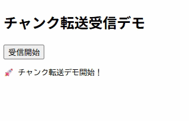
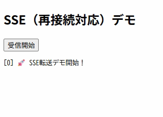

# **REST-API-PROJECT：REST-API / RESTful-API サーバー開発環境（PHP × PSR-7 × State Machine）**

本プロジェクトは、REST-API および RESTful-API を高速かつ柔軟に構築するための PHP 製クロスプラットフォーム対応サーバー開発環境です。  
SOCKET-MANAGER Framework をベースに、PSR-7準拠のHTTPメッセージ、イベント駆動、ステートマシン、Chunked Transfer、SSE など、モダンなAPI開発に必要な機能を網羅しています。

REST-API / RESTful-API の両方に最適化された構成により、拡張性の高い API サーバーを効率的に構築できます。

---

# 【 特徴 】

## REST-API / RESTful-API 対応  
標準的な REST-API 設計に加え、RESTful-API の思想に沿ったリソース指向の実装にも対応しています。  
PHP が動作する環境であれば OS を問わず利用できます。

## クロスプラットフォーム（PHP環境）  
Linux / macOS / Windows など、PHP が動作する環境であれば同一の開発体験を提供します。

## PSR-7準拠のリクエスト／レスポンス  
本プロジェクトは PSR-7（HTTP Message Interface）に準拠しており、  
REST-API / RESTful-API の標準的な実装と高い互換性を持ちます。

OAuth2 などの PSR-7 対応認証モジュールとも連携可能です。

PSR-7 公式仕様：  
https://www.php-fig.org/psr/psr-7/

PSR-7 ラッパーの詳細な使い方はこちら：  
https://socket-manager.github.io/document/rest-api/psr7.html

## SOCKET-MANAGER Framework 製  
SOCKET-MANAGER Framework が持つビルトインのステートマシンにより、  
REST-API / RESTful-API の実装方式を柔軟に選択できます。

---

# 【 実装形態 】

## 1. イベントハンドラタイプ  
単一ハンドラで REST-API を実装するシンプルな方式です。  
一般的な RESTful-API の CRUD 実装に最適です。

## 2. ステートマシンタイプ  
UNIT（状態）単位で処理を分割する方式で、以下のような REST-API / RESTful-API の高度な処理に最適です。

- Chunked Transfer（チャンク転送）  
- Server-Sent Events（SSE）  
- Range送信  
- IPC（サーバー間通信）  
- 長時間接続・分割送信が必要なAPI  

通常のサーバー設定では単一ハンドラでまとめて送信されがちなチャンク転送も、  
ステートマシンタイプではほぼ確実に分割送信されます。

### Chunked Transfer デモ（分割送信）

ステートマシンタイプでは、Chunked Transfer による分割送信が確実に行われます。  
以下の GIF アニメでは、5秒間隔でチャンクが送信される様子を確認できます。



### SSE（再接続対応）デモ

Server-Sent Events（SSE）では、クライアントが切断された場合でも再接続後に続きから受信できます。  
以下の GIF アニメでは、接続断 → 再接続 → 続きのイベント受信までの流れを確認できます。



---

# 【 サンプル 】

REST-API / RESTful-API の動作確認ができるサンプルを同梱しています。  
イベントハンドラタイプ／ステートマシンタイプの両方を用意しています。

## ユーザー情報操作（CRUD）
- GET: ユーザー一覧取得  
- POST: 新規ユーザー作成  
- PUT: ユーザー全体更新  
- PATCH: ユーザー部分更新  
- DELETE: ユーザー削除  

## Multipart アップロード
- アップロード済みファイルの確認  
- Multipart形式でのファイルアップロード  

## Chunked アップロード
- Chunkedアップロード済みファイルの確認  
- curlコマンドによるアップロード（ブラウザ制約回避のため）

## チャンク転送デモ  

## SSE（再接続対応）デモ  

## Rangeヘッダを使った分割送信デモ

---

# 【 ドキュメント 】
本 README では概要とサンプルを中心に紹介しています。  
実装方式（イベントハンドラ型 / ステートマシン型）、PSR-7 ラッパー、ルーティング、Chunked / SSE / Range 送信などの詳細仕様は  
以下の公式ドキュメントにまとめています。

REST-API サーバー開発環境ドキュメント：  
https://socket-manager.github.io/document/rest-api/

---

# 【 導入方法 】

以下のコマンドで REST-API / RESTful-API 開発環境を作成します。

```
composer create-project socket-manager/rest-api <任意のプロジェクトフォルダ>
```

---

# 【 サンプルの起動方法 】

## 1. サーバー起動  
REST-API / RESTful-API の実装方式を選択して起動できます。

### イベントハンドラタイプ
```
php worker app:event-handler-sample
```

### ステートマシンタイプ
```
php worker app:state-machine-sample
```

## 2. ブラウザでサンプル画面を表示  
```
http://localhost:10000/sample.html
```

※ サンプルサーバーが Web サーバーを兼ねているため、別途 Web サーバーは不要です。  
※ ドキュメントルートは `./setting/parameter-sample.php` で変更可能（デフォルト：`public/`）。

---

# 【 Contact Us 】
バグ報告やご要望などは<a href="mailto:lib.tech.engineer@gmail.com">`こちら`</a>から受け付けております。

---

# 【 License 】
MIT, see <a href="https://github.com/socket-manager/new-project/blob/main/LICENSE">LICENSE file</a>.